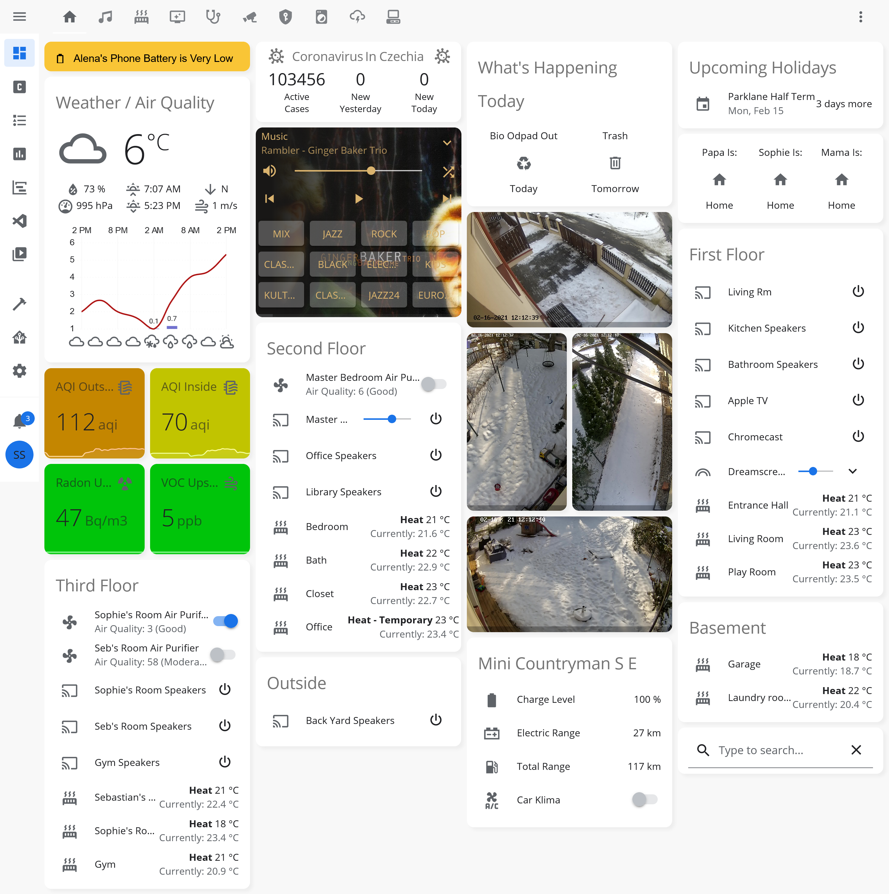
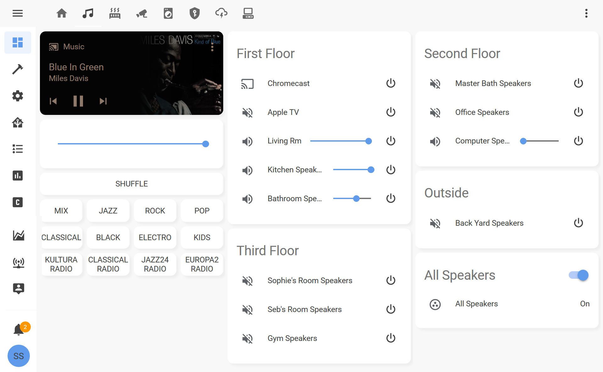
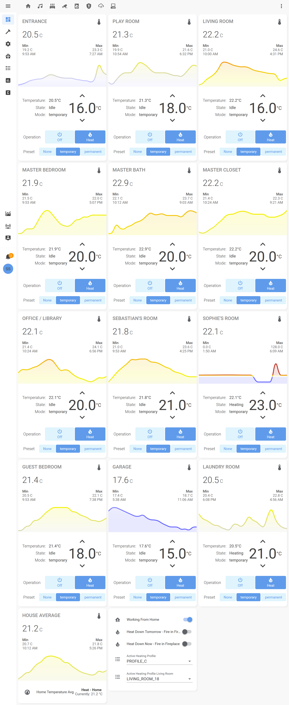
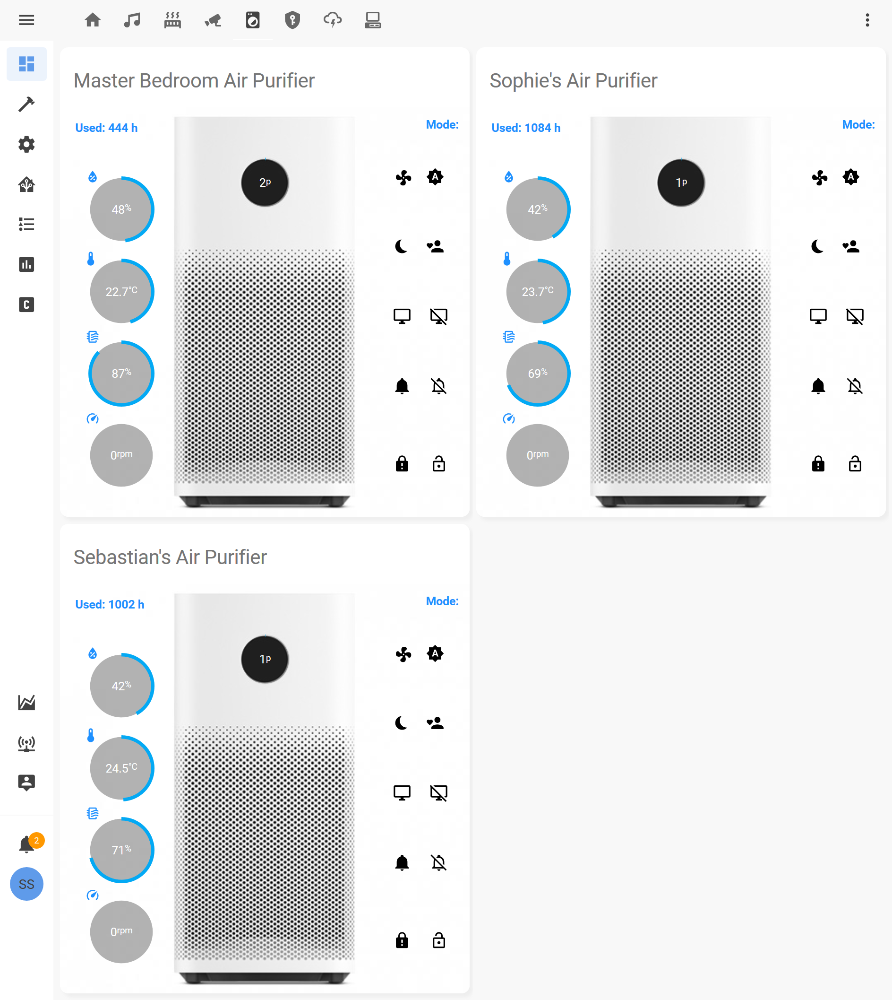
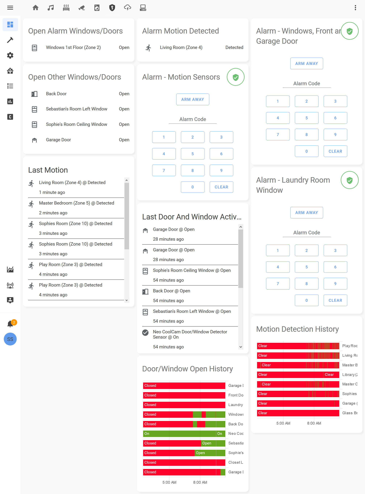
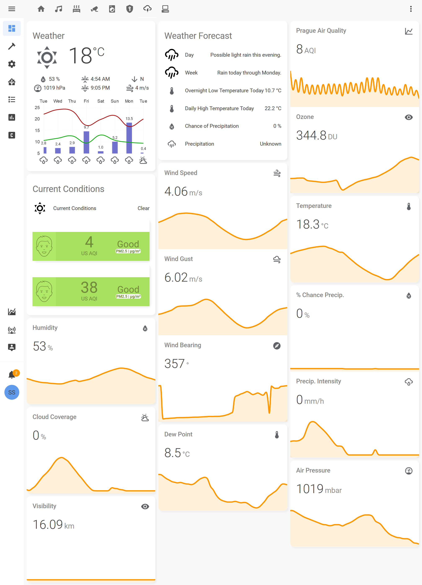
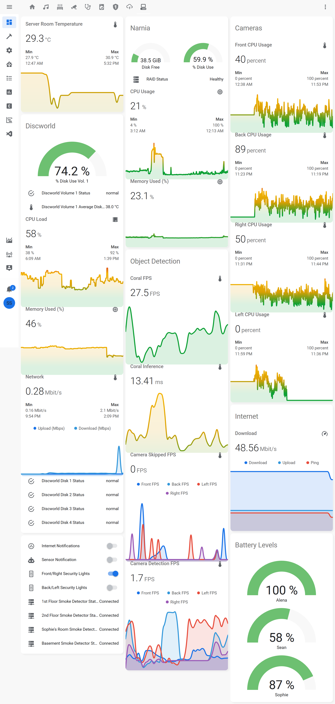

# Sean Straus' Home Assistant Configuration  
(Home Assistant Supervised, Ubuntu Server 18.04.1 LTS, 2011 Mac Mini)

Hello there. This is an incomplete and probably out of date description of what I'm doing with home assistant, but hopefully it will be of some use for ideas and samples to someone.

Some things that may be interesting to you from my config which are not so common or are unique from how much I've obsessed over them are the:

* 10 Zone [Apple Airtunes](https://www.home-assistant.io/integrations/itunes/) whole house audio deployment with playlist buttons and lists
* The [tensorflow](https://www.tensorflow.org/) based human detection using [frigate](https://github.com/blakeblackshear/frigate) and a [Google coral USB stick](https://coral.ai/products/accelerator/) on my [hikvision cameras](https://www.hikvision.com/content/dam/hikvision/en/support/regional-materials/brazil/DS-2CD2620F-I(S)%20%20-%20customized%20for%20Cangacu%20City%20-%20Bidding%2004-2015.pdf)
* The 12 zone [Honeywell Evohome](https://www.home-assistant.io/integrations/evohome/) heating system which is heavily automated with a custom [python script](https://github.com/scstraus/home-assistant-config/blob/master/python_scripts/set_heat_weather_override.py) to manage temperature settings and schedules based on the weather and automations to turn down the heat when the windows are open
* [Paradox Alarm Integration](https://community.home-assistant.io/t/paradox-alarm-mqtt-hassio-addon/38569) integrated with the human detection and many notification scenarios

There are a lot of other little things that I've not seen anyone else do, but I don't want to clutter up the intro too much, so more easter eggs inside. I've tried to include enough description and links to relevant items that you might be able to understand and replicate what I've done. Many of the more useful things I have automated require nothing other than a plain vanilla homeassistant install and some free things like weather components and iOS device trackers which everyone can have out of the box, so don't feel like you need special hardware to take part.

Last update: [July 13, 2020 (Hass v.112.4)](https://github.com/scstraus/home-assistant-config/tree/af7c89d6bd5ebc9326ff00f6ab0cd645ae37e87b), but make sure you check the history in the code snippet I linked to to see which version I was on when I documented it, because in most cases I documented it on an older version than that and you may have to find the more recent update in the repo for it to work properly on new versions. Unfortunately to link to the snippets directly, I have to use the version I am on when I write the documentation for the line numbers to match, but I don't go back and update the docs to the latest version every time I make changes to the code. To see the new versions of the code, click on the headers for the whole section or the file links themselves above, those will take you to the latest version of the file with any changes I've made for the version I'm on now shown at the beginning of this paragraph.

How to navigate this readme:

1) Choose something that interests you below and click on it
2) Read the description of it
3) Click on the header for the description to be taken to the code (this will be an older version of the code than what I'm currently running which matches the current version when I wrote the documentation but hopefully will be enough to give you the idea and with luck hasn't changed)
4) The header for category will take you to the latest version of the whole file (this should be up to date, or you can choose the file above for an up to date one)

# Table of Contents

- [Lovelace UI](#lovelace-ui)
  * [Tab 1: Main Dashboard](#tab-1-main-dashboard)
  * [Tab 2: Music](#tab-2-music)
  * [Tab 3: Heat](#tab-3-heat)
  * [Tab 4: Cameras](#tab-4-cameras)
  * [Tab 5: Appliances](#tab-5-appliances)
  * [Tab 6: Alarm](#tab-6-alarm)
  * [Tab 7: Weather](#tab-7-weather)
  * [Tab 8: System](#tab-8-system)
- [Automations](#automations)
  * [Appliance Automations](#appliance-automations)
    + [Guessing whether the dishes in the dishwasher are clean or dirty based on the Bosch integration](#guessing-whether-the-dishes-in-the-dishwasher-are-clean-or-dirty-based-on-the-bosch-integration)
    + [Using Zwave power report to determine Miele washing machine state](#using-zwave-power-report-to-determine-miele-washing-machine-state)
    + [Using Zwave power report to determine LG washing machine state](#using-zwave-power-report-to-determine-lg-washing-machine-state)
    + [Automate Air Purifiers based on outdoor air quality and make them "available" even when they aren't available](#automate-air-purifiers-based-on-outdoor-air-quality-and-make-them-avaiable-even-when-they-arent-available)
  * [Climate Automations](#climate-automations)
    + [Turning down the heater radiator valves when windows are open](#turning-down-the-heater-radiator-valves-when-windows-are-open)
    + [Adjusting the heat based on the weather](#adjusting-the-heat-based-on-the-weather)
    + [Adjusting the heat based on special situations 1: Staying home from school](#adjusting-the-heat-based-on-special-situations-1-staying-home-from-school)
    + [Adjusting the heat based on special situations 2: Fire in the fireplace](#adjusting-the-heat-based-on-special-situations-2-fire-in-the-fireplace)
    + [Adjusting the heat based on special situations 3: Working from home](#adjusting-the-heat-based-on-special-situations-3-working-from-home)
    + [Getting notified of extremely windy weather](#getting-notified-of-extremely-windy-weather)
  * [Location Automations](#location-automations)
    + [Setting my location and direction of travel based on complex rules](#setting-my-location-and-direction-of-travel-based-on-complex-rules)
    + [Tell me when my wife is heading home](#tell-me-when-my-wife-is-heading-home)
    + [Tell me when my wife is home](#tell-me-when-my-wife-is-home)
    + [Tell me when to take the ferry across the river if I'm biking to work](#tell-me-when-to-take-the-ferry-across-the-river-if-im-biking-to-work)
  * [Security Automations](#security-automations)
    + [Notify me if someone is spotted on our property while we are away or asleep](#notify-me-if-someone-is-spotted-on-our-property-while-we-are-away-or-asleep)
    + [Turn off the PIR outdoor security lights if it's too windy](#turn-off-the-pir-outdoor-security-lights-if-its-too-windy)
    + [Get notified if someone else turns the alarm on while you aren't home](#get-notified-if-someone-else-turns-the-alarm-on-while-you-arent-home)
    + [Get notified if the alarm is triggered](#get-notified-if-the-alarm-is-triggered)
    + [Pop up the camera feed on my kiosk tablets if it sees someone outside](#pop-up-the-camera-feed-on-my-kiosk-tablets-if-it-sees-someone-outside)
    + [History of last door or window which was activated](#history-of-last-door-or-window-which-was-activated)
    + [Tell my synology security station to start recording if a human is detected](#tell-my-synology-security-station-to-start-recording-if-a-human-is-detected)
    + [Generate snapshots of the last 10 humans detected for the swipe card on lovelace](#generate-snapshots-of-the-last-10-humans-detected-for-the-swipe-card-on-lovelace)
  * [Other Automations](#other-automations)
    + [Notify me if it's a good day to bike to work](#notify-me-if-its-a-good-day-to-bike-to-work)
    + [Variables to indicate whether packages are being delivered today from each shipping company](#variables-to-indicate-whether-packages-are-being-delivered-today-from-each-shipping-company)
    + [Notify if we have moldy conditions under the sink](#notify-if-we-have-moldy-conditions-under-the-sink)
    + [Notify me if the internet isn't working right](#notify-me-if-the-internet-isnt-working-right)
    + [Integrate to my AirVisual Nodes by SMB to get near real time indoor and outdoor air quality information](#integrate-to-my-airvisual-nodes-by-smb-to-get-near-real-time-indoor-and-outdoor-air-quality-information)
    + [Notify me and my wife on our phones when it's time to take out trash or compost](#notify-me-and-my-wife-on-our-phones-when-its-time-to-take-out-trash-or-compost)
    + [Update my commute sensor in the morning](#update-my-commute-sensor-in-the-morning)
    + [Notify me if the basement is flooding](#notify-me-if-the-basement-is-flooding)
    + [Automatic change between daytime theme and nighttime theme](#automatic-change-between-daytime-theme-and-nighttime-theme)
    + [Send my supervisor snapshots to dropbox nightly](#send-my-supervisor-snapshots-to-dropbox-nightly)
    + [Fix the intermittent unavailability of our Xiaomi Air Purifiers' AQI sensors](#fix-the-intermittent-unavailability-of-our-xiaomi-air-purifiers-aqi-sensors) 
    + [Notify us when state holidays are coming up](#notify-us-when-state-holidays-are-coming-up)
    + [Give a switch to turn on the aircon/heating in our car remotely](#give-a-switch-to-turn-on-the-airconheating-in-our-car-remotely)
    + [Calculate change in number of coronavirus cases since yesterday](#calculate-change-in-number-of-coronavirus-cases-since-yesterday)
    + [More advanced trash day handling that accounts for whether we already took out the trash and harrasses us if we didn't](#more-advanced-trash-day-handling-that-accounts-for-whether-we-already-took-out-the-trash-and-harrasses-us-if-we-didnt)
    + [Kludge to fix the header font in the calendar card](#kludge-to-fix-the-header-font-in-the-calendar-card)
    + [Notify me if my RAID is degraded](#notify-me-if-my-raid-is-degraded)
    + [Run internet speed tests every hour](#run-internet-speed-tests-every-hour)
    + [Notify me of flooding in the server room](#notify-me-of-flooding-in-the-server-room)
    + [A couple more automations to update sensors](#a-couple-more-automations-to-update-sensors)
    + [Let us know if our son is awake during his naptime or at night](#let-us-know-if-our-son-is-awake-during-his-naptime-or-at-night)
- [Sensors](#sensors)
  * [Integration Sensors](#integration-sensors)
    + [AirVisual](#airvisual)
    + [Dark Sky](#dark-sky)
    + [IMAP Email Sensors for detecting when packages will be delivered](#imap-email-sensors-for-detecting-when-packages-will-be-delivered)
# [Lovelace UI](https://github.com/scstraus/home-assistant-config/blob/master/ui-lovelace.yaml)

My Lovelace UI is geared a lot more at troubleshooting and information than it is at control, as most of the things that need to be controlled I try to fully automate, so the first thing you will notice is a lot of color coded graphs where I can quickly see if there's an issue. I can control things too, but I tend to keep the controls as concise as possible in a long list sorted by floor and room so I can just scroll down and get the one I want quickly.. I don't bother with big fancy controls because I don't use them.

The next thing you might notice is that I use [custom header](https://github.com/maykar/custom-header) to shrink down the header and change it's color. I also simplify some of the views for my family and kiosks by removing the sidebar. 

I use [custom sidebar](https://github.com/Villhellm/custom-sidebar) to also rearrange the icons on the panel to sort them more in the order of how often I use them. 

For [themes](https://github.com/scstraus/home-assistant-config/blob/master/themes.yaml), I am using customized versions of the [Google Light theme](https://github.com/JuanMTech/google_light_theme) and [Midnight theme](https://community.home-assistant.io/t/midnight-theme/28598) which switch automatically 30 minutes after the sun goes down and when the sun comes up to match when my cameras go into infrared mode based on [this automation](https://github.com/scstraus/home-assistant-config/blob/9e638272e121710738e05d08d2c5b1a145a0ae42/automations/other_automations.yaml#L585-L612). All of my customizations can be found at the bottom of the theme files for those two [themes in the theme directory](https://github.com/scstraus/home-assistant-config/tree/master/themes). I put a comment before my changes showing which changes were mine so you can do the same if you want to get the same look.

 I will try to get around to making screenshots of the night theme to put here.

## [Tab 1: Main Dashboard](lovelace/Tab1_Home.yaml)

So, tab 1 is basically the main information view of the system, and if you scroll down, has quick access to most of the functions and important data in a concise format. Much of this is expanded in other tabs, but kept here as well for easy access.

This view also comes in a [kiosk flavor which I use on my 8" Amazon Kindle Fire tablets around the house with a more fixed layout for that device](lovelace/Tab1a_Home_Kiosk.yaml) which I achieve with [custom:lovelace-layout-card](https://github.com/thomasloven/lovelace-layout-card). Mostly there's just some layout changes and some customizations around not using camera streams but rather just the 5-10 second refreshing cameras due to the lower resources on the kindle.

  
But one interesting thing I have on the tablets is that they will use [popup cards](https://github.com/thomasloven/hass-browser_mod#popup) from the [Browser Mod](https://github.com/thomasloven/hass-browser_mod) custom component to popup the camera feeds on the tablets if it sees someone outside while we are home. Mostly we use this for keeping an eye on the kids while they are outside. If we are not at home with the alarm on or asleep, we will get emergency notifications on our phone instead. You can see these in the automations.

I will describe the cards I have here in the order I use them in my config so you can find them in the config file linked above. It's almost all custom cards, so there were a lot of great devs that made it happen. At least half of what I do here is probably somehow enabled by [custom cards from Thomas Loven](https://github.com/thomasloven) so a special shout out and million thanks for all his many contributions. My lovelace view would simply not be possible without these custom card devs.

**[Popup Cards](https://github.com/thomasloven/hass-browser_mod#popup) from custom component [Browser Mod](https://github.com/thomasloven/hass-browser_mod):**
Some popups that happen when you tap specific things

- **[Weekly weather popup](https://github.com/scstraus/home-assistant-config/blob/9e638272e121710738e05d08d2c5b1a145a0ae42/lovelace/Tab1_Home.yaml#L11-L16)** for when you tap on the daily forecast card to give you weekly variant
- **[Location descriptions and ETA](https://github.com/scstraus/home-assistant-config/blob/9e638272e121710738e05d08d2c5b1a145a0ae42/lovelace/Tab1_Home.yaml#L18-L55)** if you click on the locations for family members. This is a human readable description of where the person is, and an estimate of when they will be home if they are heading home, or how long it would take them if they started now if they aren't home. This is the same thing Alexa will read out if I ask her when they will be home.
- **[For air purifiers shows their availability and status as well as room AQI.](https://github.com/scstraus/home-assistant-config/blob/9e638272e121710738e05d08d2c5b1a145a0ae42/lovelace/Tab1_Home.yaml#L57-L115)** I had to customize this because they were going unavailable quite frequently, so I made input selects and automations that would cache the desired state until they became available and then change the real ones. I also changed AQI to standard AQI measurement rather than than direct particle measurement.
- **[Car popup when you click on the car lock button](https://github.com/scstraus/home-assistant-config/blob/9e638272e121710738e05d08d2c5b1a145a0ae42/lovelace/Tab1_Home.yaml#L117-L135)**, it will let you lock (but not unlock) the car.

**[Entity Filter Cards](https://www.home-assistant.io/lovelace/entity-filter/):**
These are how I get important statuses on lots of things without creating a lot of clutter, as they pop up only when they have something to tell me. I fudged the states on some stuff for the screenshot so you could see more of them. The real view usually looks more like what I show on the tablet.

- **[Emergency Alert](https://github.com/scstraus/home-assistant-config/blob/9e638272e121710738e05d08d2c5b1a145a0ae42/lovelace/Tab1_Home.yaml#L149-L233)** Pops up when there's something seriously wrong like the smoke alarms are going off, electricity is out, there's flooding, or (usually not actually very urgent) there's a human being shown on one of the cameras.
- **[Low Battery](https://github.com/scstraus/home-assistant-config/blob/9e638272e121710738e05d08d2c5b1a145a0ae42/lovelace/Tab1_Home.yaml#L235-L261)** Does what you'd expect. Tells you when the battery is low on one of about currently 15 devices like phones or zwave devices. I have more to add like my TRV's on the radiators which will come with a future HGI-80 release.
- **[What's Happening Today](https://github.com/scstraus/home-assistant-config/blob/9e638272e121710738e05d08d2c5b1a145a0ae42/lovelace/Tab1_Home.yaml#L263-L324)** This is the main heads up display that will show most of the status you need at a glance. It's the only one of these cards that's usually open. it shows the following things:
  - If we have a package coming from one of 4 carriers (DHL, Czech post, DPD, or GLS) based on emails we recieve
  - If it's the day to take out the trash or composting based on the schedules for those
  - If it's a good day to bike to work based on a lot of different weather conditions
  - If doors and windows around the house are open
  - If the dishwasher or clothes washing machines have finished washing and have clean clothes/dishes waiting to be taken out (some of this is done by monitoring the power with zwave switches if that's interesting to you)
  - If any of the alarm zones are armed
  - If the car needs gas or charging of it's battery (it's a hybrid), or if it has any faults it's reporting
  - How many total active coronavirus cases there are and how many new ones there were yesterday and today
- **[Upcoming Holidays](https://github.com/scstraus/home-assistant-config/blob/9e638272e121710738e05d08d2c5b1a145a0ae42/lovelace/Tab1_Home.yaml#L326-L365)** Didn't get this one on the screenshot, but it looks at 2 ical calendars for Czech national holidays and my daughter's school calendar to show holidays that are coming up in the next week and counts down number of days until they come with [custom:secondary-info-row](https://github.com/custom-cards/secondaryinfo-entity-row) to make the second row showing the number of days.

**I'll just list the rest of the cards here as you can see what they do on the screenshot:**

- [custom:weather-card-chart](https://github.com/Yevgenium/lovelace-weather-card-chart)

  (love having the chart in my weather forecast)

- [custom:vertical-stack-in-card](https://github.com/ofekashery/vertical-stack-in-card)

  (just combines the other cards into one card)

- [custom:button-card](https://github.com/custom-cards/button-card)

  (labels for the air quality card and reminders card because the ones on the card didn't match my theme)

- [custom:air-visual-card](https://github.com/dnguyen800/Air-Visual-Card)

  (air quality)

- [glance card](https://www.home-assistant.io/lovelace/glance/)

  (to show location of family)

- [custom:mod-card](https://github.com/thomasloven/lovelace-card-mod#mod-card) from the [card-mod addon](https://github.com/thomasloven/lovelace-card-mod)

  (to report a size for vertical stack-ins (so far lovelace couldn't handle this properly, but it looks like this [might get fixed finally](https://github.com/home-assistant/frontend/issues/5321#event-3379916050)))

- [custom:calendar-card](https://github.com/ljmerza/calendar-card)

  (for the reminders view)

- [conditional card](https://www.home-assistant.io/lovelace/conditional/)

  (to take away the label on the reminders view when there are no calendar items. Very kludgey way to fix the wrong font on the calendar label.)

- [custom:state-switch](https://github.com/thomasloven/lovelace-state-switch) and [custom:mod-card](https://github.com/thomasloven/lovelace-card-mod#mod-card) from the [card-mod addon](https://github.com/thomasloven/lovelace-card-mod)

  (to decide whether to show the real time camera feeds or the non-real time ones (one frame every 5-10 seconds), depending on whether I'm home or not. The real time feeds are very sensitive to device and bandwith and won't update if the conditions aren't right, so I try only to show them when I'm on wifi on a device capable of showing them (not on my kindle tablets).)

- [picture glance cards](https://www.home-assistant.io/lovelace/picture-glance/)

  (for the camera streams)

- [custom:mini-media-player](https://github.com/kalkih/mini-media-player)

  (for playing music from my itunes library to one of ~10 airplay zones around the house, each of which also uses a mini media player card to give an on/off button and volume control for the zone)

- [custom:button-card](https://github.com/custom-cards/button-card)

  (for playlist selection of music and shuffle control)

- [entity filter card](https://www.home-assistant.io/lovelace/entity-filter/)

  (to show anything important that's happening with the car, or very little if nothing much is happening.)

- [entities card](https://www.home-assistant.io/lovelace/entities/) with my climate entities

  (to show temperature in each heating zone. You can tap it to adjust the heat or see a graph. Also showing my air purifiers where I again use the [custom:secondaryinfo-entity-row](https://github.com/custom-cards/secondaryinfo-entity-row) to show the air quality index)

- [custom:search-card](https://community.home-assistant.io/t/lovelace-a-simple-search-card/127180)

  (to search for entities not shown here. I mainly use it to get history graphs of entities that are used in verious sensors so that I don't have to go to the endless wait that is the history pane)

## [Tab 2: Music](lovelace/Tab2_Music.yaml)

To play music on 10 AirTunes zones with pushbuttons for playlists.

For  this one I am using the standard [media control card](https://www.home-assistant.io/lovelace/media-control/) as I don't mind it taking up a bit more room on this tab and it has pretty pictures of what's playing. 

For a persistent master volume slider I've had to use a [custom:slider-entity-row](https://community.home-assistant.io/t/slider-entity-row-add-sliders-to-entities-cards/140452) so that you don't have to tap the media player to get to it.

The playlist buttons are [custom:button-card](https://github.com/custom-cards/button-card)

And the volume and on/off controls for the speakers are [custom:mini-media-player](https://github.com/kalkih/mini-media-player) just like I used in the first tab.

There's also a [group](https://www.home-assistant.io/integrations/group/) for when I want to turn on/off all the speakers.

## [Tab 3: Heat](lovelace/Tab3_Heat.yaml)

This is the in-depth heat control which allows me to see the heat graph for each room and set more of the settings like whether the rooms are running from the schedule that's programmed into evohome, or in override mode. 

Most of the interesting stuff about my heating happens in the [heating automations](#climate-automations) and my [custom python script](https://github.com/scstraus/home-assistant-config/blob/master/python_scripts/set_heat_weather_override.py) for setting heat profiles based on weather. This tab is mainly for debugging the automated side of it.

I use [popup cards](https://github.com/thomasloven/hass-browser_mod#popup) from the custom component [browser_mod](https://github.com/thomasloven/hass-browser_mod) to ensure I get the standard [history-graph](https://www.home-assistant.io/lovelace/history-graph/) graph if you tap on the pretty [custom:mini-graph-card](https://github.com/kalkih/mini-graph-card). The history graph also shows the historical setpoint of the thermostat and some guess at when the TRV was open, but lacks the color coding and beauty of the mini graph card. So I use the mini graph card for a quick overview of where there might be issues and to keep things pretty, and then I click if I want to dig into the "why" of what's happening with the heating to see the uglier and more detailed view. Maybe someday I will see if I can consolidate it all onto one graph, but I'm not sure it's possible with the graph card.

What I'm using for most of the view is mostly just a bunch of [custom:vertical-stack-in-cards](https://github.com/ofekashery/vertical-stack-in-card) to stack the [custom:mini-graph-card](https://github.com/kalkih/mini-graph-card) for each room on top of a [custom:lovelace-mini-thermostat card](https://github.com/Devqon/lovelace-mini-thermostat) for each room. That gives you the temperature history of each room with nice color coding for hot and cold on top of the control to set it manually. Mini thermostat saves a lot of space over the normal thermostat card here. 

Way down at the bottom, you will see an entities card with some input-selects for special heating cases like when I'm working from home or when there's a fire in the fireplace. Others happen automatically through automation like when my daughter is home from school for the day. The input selects are the output from my [python script](https://github.com/scstraus/home-assistant-config/blob/master/python_scripts/set_heat_weather_override.py) which takes the heating off of the schedule and turns it down depending on the weather.

## [Tab 4: Cameras](lovelace/Tab4_Cameras.yaml)

This tab shows the feeds of my security cameras on top with graphs of motion detection followed by the snapshots of the last 10 people who have been found by the human detection powered by [frigate](https://github.com/blakeblackshear/frigate) and a [Google coral USB stick](https://coral.ai/products/accelerator/) and [history graphs](https://www.home-assistant.io/lovelace/history-graph/)  of when humans were spotted.

So basically the camera views are just the [picture glance card](https://www.home-assistant.io/lovelace/picture-glance/) for showing the cameras and some [horizontal](https://www.home-assistant.io/lovelace/horizontal-stack/) and [vertical stacks](https://www.home-assistant.io/lovelace/vertical-stack/) to arrange them and [history graphs](https://www.home-assistant.io/lovelace/history-graph/) to show the history of motion.

Below that is the same structure except I am monitoring the snapshots from the human detection and the history graphs of when humans are detected. I have added the [custom:swipe-card](https://github.com/bramkragten/custom-ui/tree/master/swipe-card) so that I can swipe between the latest snapshot of people detected and the previous 10 snapshots that were captured before that using [these automations](#history-of-last-door-or-window-which-was-activated)

## [Tab 5: Appliances](lovelace/Tab5_Appliances.yaml)

This is my newest tab and is still a work in progress. The goal is to have the full controls and info from all my appliances like my dishwashers, washers and dryers, and also my car in some pretty [picture elements cards](https://www.home-assistant.io/lovelace/picture-elements/). Time will tell if I ever get around to creating all those pretty picture elements cards as they are quite a bit of work. The air purifiers already had some nice ones that some [other folks had made](https://community.home-assistant.io/t/lovelace-xiaomi-air-purifier-card/72924/4) and I just had to update them a bit for the most recent versions of hass. 

So, these are some [picture elements cards](https://www.home-assistant.io/lovelace/picture-elements/) that I got from [here](https://community.home-assistant.io/t/lovelace-xiaomi-air-purifier-card/72924/4). Nothing else happening here.

## [Tab 6: Alarm](lovelace/Tab6_Alarm.yaml)

So, this tab is messy and ugly and I don't like it much, but it gets the job done. The main problem is that my alarm system publishes 3 alarm panels due to the way it's partitioned for home and away modes and they all show up here. 

At some point I will merge these all together into an [MQTT alarm panel](https://www.home-assistant.io/integrations/alarm_control_panel.mqtt/), but that is a big job and hard to test now that we all stay home all the time due to coronavirus. Someday..

Anyhow, the view shows the alarm panels and some history on doors and windows being opened and motion sensors tripped along with the times of the most recent activities spotted in the house. It also has some cards that pop up in real time when motion is detected around the house in case you wanted to see that in real time.

So, I'm using some of the same cards you've seen already with a couple new ones.

* [Entity Filter Cards](https://www.home-assistant.io/lovelace/entity-filter/):

  (For real time popup when doors or windows are open or movement is detected)
  
* [Alarm Panel Cards](https://www.home-assistant.io/lovelace/alarm-panel/)

  (To show the alarm panels for the different zones)
  
* [custom:home-feed-card](https://github.com/gadgetchnnel/lovelace-home-feed-card)

  (Shows the most recent events around the house for doors/windows and motion. Honestly I didn't think it could do this kind of a view but the developer, [Steven Rollanson](https://github.com/gadgetchnnel) showed me how to get it to show it like this and it works well. If you go into [this thread](https://community.home-assistant.io/t/lovelace-home-feed-card/103719/148?u=scstraus), you can see my conversation about it and other ways that were suggested that probably work too but I haven't tried.)

* [history graphs](https://www.home-assistant.io/lovelace/history-graph/) 

  (to show the history of open doors and windows and when motion was detected)
  

## [Tab 7: Weather](lovelace/Tab7_Weather.yaml)

This one is just a collection of graphs and current weather data. I mostly use it for getting the idea of recent conditions for when I'm making automations, but sometimes I'm curious about the trend of one of these weather items and I take a peek over at this tab. 

These cards you've already seen elsewhere in my config.

- [custom:weather-card-chart](https://github.com/Yevgenium/lovelace-weather-card-chart)

  (love having the chart in my weather forecast)

- [custom:air-visual-card](https://github.com/dnguyen800/Air-Visual-Card)

  (air quality)

- [custom:button-card](https://github.com/custom-cards/button-card)

  (labels for the air quality card and reminders card because the ones on the card didn't match my theme)
  
- [entities card](https://www.home-assistant.io/lovelace/entities/) 

  (current weather data)
  
- [custom:mini-graph-card](https://github.com/kalkih/mini-graph-card)

  (historical weather data)

## [Tab 8: System](lovelace/Tab8_Tech.yaml)

Here is the system status of my Synology NAS that runs my Plex and Frigate instances as well as general backups and file serving and Home Assistant server (2011 Mac Mini + Ubuntu with RAID SSD's), as well as random other things I wanted shown somewhere for monitoring and tweaking.

- [custom:vertical-stack-in-card](https://github.com/ofekashery/vertical-stack-in-card)

  (to merge everything for each server into a card)

- [custom:mini-graph-card](https://github.com/kalkih/mini-graph-card)

  (historical cpu, memory data and network data)

- [gauge card](https://www.home-assistant.io/lovelace/gauge/)

  (current battery levels and disk use)

- [entities card](https://www.home-assistant.io/lovelace/entities/) 

# Automations

Automations are divided into a few files to keep file size ~1000 lines, they are good categories to divide by too, so each category below is a link to a file.

## [Appliance Automations](https://github.com/scstraus/home-assistant-config/blob/master/automations/appliance_automations.yaml)

This is everything having to do with automating appliances. Much of this is simply deriving the state of the appliance based on the data we have and sending notifications, but also we do things like run air purfiers based on the air quality outside. More detail below.

### [Guessing whether the dishes in the dishwasher are clean or dirty based on the Bosch integration](https://github.com/scstraus/home-assistant-config/blob/9e638272e121710738e05d08d2c5b1a145a0ae42/automations/appliance_automations.yaml#L1-L88)

The lines of code linked above show how I am using the [Home Connect](https://www.home-assistant.io/integrations/home_connect/) integration to monitor my Bosch dishwasher. It provides data around when it's washing and how much time is left (some of which I'd like to add to the appliance tab someday), and it also provides a door sensor. So what I'm doing here is just monitoring the states and copying some over to an input select which I really use to tell the status. 

Then I add my own status about whether the dishes are clean or dirty or emptying using a timer that starts counting down how long the door has been open after finishing washing. If the door is closed and the counter hasn't counted to 5 minutes of being open yet, then the dishes are clean. If the door is open and the counter hasn't counted down to 5 minutes of being open yet, then the dishes are emptying. Otherwise if the counter has counted 5 minutes of the door being open, the dishes are dirty.

Then based on the clean and dirty dishes, I have [some automations to yell at you](https://github.com/scstraus/home-assistant-config/blob/9e638272e121710738e05d08d2c5b1a145a0ae42/automations/appliance_automations.yaml#L90-L197) from the alexa nearby when you open the door to tell you that the dishes are clean or still washing or send a notification to your phone when they finish washing.

### [Using Zwave power report to determine Miele washing machine state](https://github.com/scstraus/home-assistant-config/blob/9e638272e121710738e05d08d2c5b1a145a0ae42/automations/appliance_automations.yaml#L200-L380)

This one is an idea [I got from this excellent guide](https://philhawthorne.com/making-dumb-dishwashers-and-washing-machines-smart-alerts-when-the-dishes-and-clothes-are-cleaned/) from [Phil Hawthorne of hass podcast fame](https://philhawthorne.com) about how to make dumb dishwashers smart with a power monitoring smart plug.

Basically, it just watches the power utilization for certain spikes and troughs which indicate it's moving through it's washing cycle until it's able to determine that the clothes are clean and then it sends us a notification so that we know it's time to hang the clothes or put it in the dryer. It works pretty well. It would need some kind of door sensor to tell if it was empty or not, but that's not so important, it does the job.

### [Using Zwave power report to determine LG washing machine state](https://github.com/scstraus/home-assistant-config/blob/9e638272e121710738e05d08d2c5b1a145a0ae42/automations/appliance_automations.yaml#L383-L503)

Yes, we have 2 washing machines. Had to run power from all the circuits in the basement, but anything for my wife.

This one is actually up for partial replacement as I finally got the [SmartThinQ  custom component](https://github.com/ollo69/ha-smartthinq-sensors) working thanks to HACS.. But it's already working alright so it's not a high priority at the moment, and the SmartThinQ integration still doesn't give me a door sensor, so it's really just a new way to tell when washing starts/stops, which was working pretty well using the [Zwave power consumption method](https://philhawthorne.com/making-dumb-dishwashers-and-washing-machines-smart-alerts-when-the-dishes-and-clothes-are-cleaned/).

So it just does the same thing as for the other washing machine and primarily tells us when the laundry is done washing (though it does also track some in between states which I might show on the appliances tab and try to derive time to finish from some day). 

Someday I should add the dryers too, but my wife hasn't mentioned that it was a major priority and it's a lot of trial and error to get these power monitoring integrations going, so for now that's on the back burner.

### [Automate Air Purifiers based on outdoor air quality and make them "avaiable" even when they aren't available](https://github.com/scstraus/home-assistant-config/blob/9e638272e121710738e05d08d2c5b1a145a0ae42/automations/appliance_automations.yaml#L508-L1062)

So, this is 500 lines of config dedicated just to 3 Xiaomi air purifiers for our bedrooms, and there's also some input booleans and variables used to support this in my [configuration.yaml](https://github.com/scstraus/home-assistant-config/blob/master/configuration.yaml). I'll explain why. 

First off, the goal. We have an [AirVisual Pro](https://www.iqair.com/air-quality-monitors/airvisual-pro) node outside and inside that we've integrated using a kind of kludgey solution using SMB and some command line commands and [automations](https://github.com/scstraus/home-assistant-config#integrate-to-my-airvisual-nodes-by-smb) but which actually works really well. Having monitored the indoor and outdoor air quality for some time, I had a pretty good idea of when the air purifiers needed to switch on and off.  In common areas, we use some older ones we had already and just run them when we are in the room and the AQI is getting bad (though when these die I will replace them with more of the Xaiomi ones and automate them too).

The bedrooms where really where automation helped, because a lot of times the AQI would spike in the night. For this, an automated solution is perfect and the automatic mode on these air purifiers is garbage because it's relying on the (quite bad) AQI measurements of the cheap AQI sensor in the device.. They give some general (innacurate) idea of room AQI when the purifier is off, but as soon as it turns on, the AQI goes to 1 despite what the reality is in the rest of the room. Also the automatic mode is always running the air purifier, even when it's not needed. 

So it's much more sensible just to run these air purifiers when we know we are actually using the room and when the air quality outside is bad enough. That also covers the cases for when we are sleeping and the air quality starts getting bad during the night. The final solution works really well at both preserving the filter for when it's actually needed, and in keeping the air in the rooms clean for when we are actually in the rooms, with zero manual intervention.

Much of the automations you will see here is dedicated to dealing with a problem with these air purifiers. They go offline every few minutes. According to some reports, this is due to wifi configuration options on your routers, but I couldn't do anything about it with my old Airport wifi routers. So what I did was to create some variables and input booleans to "cache" the state of the air purifier and it's reported AQI while it was offline, so that you could still make a nice AQI report and graph and send on/off commands to the air purifier even though it was unavailable. It would simply wait until the air purifier was available again to update the state of the air purifier or input boolean and AQI reading. This works well now and can be relied upon when automating and reporting state. I don't need it for the master bedroom one, because for some reason that one doesn't have this problem more than once in a blue moon, so it's only for the other bedrooms. I won't go into all the gory detail, but PM me if you want it.

## [Climate Automations](https://github.com/scstraus/home-assistant-config/blob/master/automations/climate_automations.yaml)

These are the automations that work alongside my [custom python script](https://github.com/scstraus/home-assistant-config/blob/master/python_scripts/set_heat_weather_override.py) to control the heating in my 12 zone [Honeywell Evohome](https://getconnected.honeywellhome.com/en/evohome) system using the [official integration](https://www.home-assistant.io/integrations/evohome/). Big shout out to [David Bonnes](https://github.com/zxdavb) for his amazing work on this component, and trying to cram every last possible feature into it. It's getting really powerful.

My heating system is a bit complicated but it works pretty well. The Evohome Thermostat has a nice UI for entering complex schedules room by room, so when it's cold enough to be on the normal heating schedule I just use that. When it starts getting warmer and I don't need to run the heat during the day, I start to turn down the heat in some of the rooms more using my [custom python script](https://github.com/scstraus/home-assistant-config/blob/master/python_scripts/set_heat_weather_override.py) to read the weather report and decide what to set the temperature in each room to so that it won't be too cold but also won't run the heat unneccessarily. I think more than half of my heating savings come from not heating up the rooms too much overnight if they will warm themselves up during the day anyway. And everything is still the right temperature. Actually even better because they don't get too hot during the day.

### [Turning down the heater radiator valves when windows are open](https://github.com/scstraus/home-assistant-config/blob/9e638272e121710738e05d08d2c5b1a145a0ae42/automations/climate_automations.yaml#L1-L613)

My wife likes to leave the windows open around the house with the radiators blasting full blast right in under them just sending the heat straight out the windows. So I turn them off while the windows are open.

I've got it working for the winter when the heating is in auto (schedule) mode because the thermostat will return back to the schedule when I cancel the override, but for the rest of the year it won't do that, so I've commented out all those attempts. I think the only thing that will work for all cases is if I write an app daemon to do this. Someday maybe I will.. But for now, just doing it in the cold winter months covers most of the cases where the radiator is running and the window is open with cold weather.

### [Adjusting the heat based on the weather](https://github.com/scstraus/home-assistant-config/blob/9e638272e121710738e05d08d2c5b1a145a0ae42/automations/climate_automations.yaml#L616-L1314)

So, you can see a lot of commented out lines here. I used to have a bunch of automations that did this, but as I fine tuned the cases more, it just became easier and much more understandable when laid out in python code. So, now I just have one automation here which calls my python script at 12:30 AM every day and sets the temperature for the next 24 hours if it's going to be warm enough that the house will warm itself up during the day. I won't bother describing all the rules here because [I documented the python script pretty well, and it's pretty readable if you want to take a look](https://github.com/scstraus/home-assistant-config/blob/master/python_scripts/set_heat_weather_override.py). It publishes what heating profile it chose to my [heating lovelace tab at the bottom](https://raw.githubusercontent.com/scstraus/home-assistant-config/master/readme_images/Tab3_heat.png) via some input_selects.

### [Adjusting the heat based on special situations 1: Staying home from school](https://github.com/scstraus/home-assistant-config/blob/9e638272e121710738e05d08d2c5b1a145a0ae42/automations/climate_automations.yaml#L1321-L1345)

Normally we don't heat the kids rooms while they are at school, but if I see them home after a certain time, I have it turn back on during the day automatically.

### [Adjusting the heat based on special situations 2: Fire in the fireplace](https://github.com/scstraus/home-assistant-config/blob/9e638272e121710738e05d08d2c5b1a145a0ae42/automations/climate_automations.yaml#L1347-L1405)

Our fireplace warms up the rooms near it a lot so I want the heating off while (or before) it's running. This one has 2 flavors, one if I plan to have a fire the next morning, in which case I don't let the heat turn up in the morning, otherwise I just turn the heat down while the fire is going if I say I want to have a fire now. These are controlled by an input boolean on the heating tab.

### [Adjusting the heat based on special situations 3: Working from home](https://github.com/scstraus/home-assistant-config/blob/9e638272e121710738e05d08d2c5b1a145a0ae42/automations/climate_automations.yaml#L1407-L1443)

So this one is similar to the one for staying home from school, but I trigger it manually because I don't always go to work at exactly the same time. Sometimes I will work from home only part of the day. But since COVID-19, I've been staying home every day, so it just stays on and heats the office every day.

### [Getting notified of extremely windy weather](https://github.com/scstraus/home-assistant-config/blob/9e638272e121710738e05d08d2c5b1a145a0ae42/automations/climate_automations.yaml#L1449-L1485)

Sometimes it gets really windy here and blows all our stuff around. This one warns me of that situation. Though it's never triggered so it either hasn't gotten that windy yet or it doesn't work ;-). More testing needed on this one.

## [Location Automations](https://github.com/scstraus/home-assistant-config/blob/master/automations/location_automations.yaml)

### [Setting my location and direction of travel based on complex rules](https://github.com/scstraus/home-assistant-config/blob/9e638272e121710738e05d08d2c5b1a145a0ae42/automations/location_automations.yaml#L1-L585)

[More of the rules are here](https://github.com/scstraus/home-assistant-config/blob/9e638272e121710738e05d08d2c5b1a145a0ae42/automations/location_automations.yaml#L629-L726) and [here](https://github.com/scstraus/home-assistant-config/blob/9e638272e121710738e05d08d2c5b1a145a0ae42/automations/location_automations.yaml#L821-L832) 

As one of the most frequently asked questions of my family is "where are you and when will you be home?", I made some rather complex logic to inform them where I was and if I was heading home or to somewhere else. This answers this question in mostly the same way I would based on which zones I've traveled thorough most recently. This is displayed on my main screen as my location and they can ask Alexa the same. Time to home is calculated using Google and they can also access that by clicking on my location icon on the first tab of my dashboard or by asking Alexa.

I don't do this kind of complex logic for my wife or kids, for them I just say which zone they are in or if they aren't in a zone I report their direction of travel. You can find that in my sensors.

### [Tell me when my wife is heading home](https://github.com/scstraus/home-assistant-config/blob/9e638272e121710738e05d08d2c5b1a145a0ae42/automations/location_automations.yaml#L587-L604) 
(also [here](https://github.com/scstraus/home-assistant-config/blob/9e638272e121710738e05d08d2c5b1a145a0ae42/automations/location_automations.yaml#L800-L819))

Usually I am given a list of things to do by the time my wife gets home, so it's good to have some advanced notice to finish those things, also then I know I can call her to discuss dinner, etc.

### [Tell me when my wife is home](https://github.com/scstraus/home-assistant-config/blob/9e638272e121710738e05d08d2c5b1a145a0ae42/automations/location_automations.yaml#L606-L627)

This helps if I know she's been shopping or something, I can come help her with carrying it up the stairs and thereby earning brownie points.

### [Tell me when to take the ferry across the river if I'm biking to work](https://github.com/scstraus/home-assistant-config/blob/9e638272e121710738e05d08d2c5b1a145a0ae42/automations/location_automations.yaml#L753-L798)

So, when I'm riding my bike to work, there are some really nice ferries that I can take across the river instead of riding on the bridge next to the highway, so I am trying to have hass tell me when I can make the ferry since they only come every 20 minutes. This one is a bit tricky to get right because the zones I need to make it happen also cross some roads so I get it while I am driving too which I don't like. I added a filter to make sure I'm not doing an automotive activity, but I haven't tested if it sees me riding a bike as an automotive activity.

## [Security Automations](https://github.com/scstraus/home-assistant-config/blob/master/automations/security_automations.yaml)

### [Notify me if someone is spotted on our property while we are away or asleep](https://github.com/scstraus/home-assistant-config/blob/6027951c351dbc1df1938c6d099aa1b3218a8039/automations/security_automations.yaml#L2-L180)

Using the excellent realtime tensorflow object detection in [Blake Blashear](https://github.com/blakeblackshear)'s excellent [Frigate](https://github.com/blakeblackshear/frigate), our cameras are scanning 5 times a second for people. If our alarm is on or it's during the times we sleep and it find ones, it will send an emergency notification to our phone which bypasses do not disturb and sends us a picture in the notification of the person it found. I've been tweaking this over a year or so and it's really solid now. It's pretty much impossible to sneak past the detection and it gives near zero false positives. It's pretty damned impressive. I will try to post some videos of it in action sometime.

### [Turn off the PIR outdoor security lights if it's too windy](https://github.com/scstraus/home-assistant-config/blob/6027951c351dbc1df1938c6d099aa1b3218a8039/automations/security_automations.yaml#L298-L328)

The front security lights that are activated by PIR start turning on all the time if it gets windy and that annoys the neighbors. So we have a fibaro switch on them to turn them off automatically if it gets too windy. They turn on again for the next day. However, even if they have been switched off, they will turn back on if a person is spotted. As the human detection works very well under IR light (we have very good external IR illumination), it's not really a loss to have the lights triggered by human detection rather than PIR. It's much more accurate and pretty much catches everything anyway. Fortunately when the lights are turned on they automatically go to a turned on state, so we don't even have to wait for the PIR to detect something again.

### [Get notified if someone else turns the alarm on while you aren't home](https://github.com/scstraus/home-assistant-config/blob/6027951c351dbc1df1938c6d099aa1b3218a8039/automations/security_automations.yaml#L408-L529)

This can avoid accidentally tripping the alarm when you get home because you didn't realize someone else had armed it.

### [Get notified if the alarm is triggered](https://github.com/scstraus/home-assistant-config/blob/6027951c351dbc1df1938c6d099aa1b3218a8039/automations/security_automations.yaml#L531-L551)

This allows us to check the situation before the security company calls and asks if they need to send the bruisers.

### [Pop up the camera feed on my kiosk tablets if it sees someone outside](https://github.com/scstraus/home-assistant-config/blob/6027951c351dbc1df1938c6d099aa1b3218a8039/automations/security_automations.yaml#L584-L800)

This one automatically pulls up the camera feed on the kiosk tablets if a person is spotted outside. Handy for watching the kids while we are inside and they are out.

### [History of last door or window which was activated](https://github.com/scstraus/home-assistant-config/blob/6027951c351dbc1df1938c6d099aa1b3218a8039/automations/security_automations.yaml#L814-L885)

This apparently keeps a history of the last doors and windows that were activated.. I don't think I need it now that I'm using the Home Feed Card for this.. Maybe I had planned to see if this would be faster than the home feed which is a bit slow.. I guess I should either comment it out or test it.

### [Tell my synology security station to start recording if a human is detected](https://github.com/scstraus/home-assistant-config/blob/6027951c351dbc1df1938c6d099aa1b3218a8039/automations/security_automations.yaml#L887-L921)

The synology security station already records using motion detection, but this is an extra trigger which tells it to record when a human is detected. This ensures I don't miss any humans even if somehow the motion detection wasn't triggered (which is very rare). But it gives an added capability too, which is being able to filter the recordings only by ones where humans were detected. That means I can quickly scan only which humans were seen. If I turn up the speed, I can see all of them in a few minutes for a whole week.

### [Generate snapshots of the last 10 humans detected for the swipe card on lovelace](https://github.com/scstraus/home-assistant-config/blob/6027951c351dbc1df1938c6d099aa1b3218a8039/automations/security_automations.yaml#L923-L981)

This and a shell script populates the snapshots of the camera feeds which show the static photos of people who had been detected with the human detection. That way I can swipe through the last 10 detected on each camera using the [swiper card](https://github.com/bramkragten/custom-ui/tree/master/swipe-card).

## [Other Automations](https://github.com/scstraus/home-assistant-config/blob/master/automations/other_automations.yaml)

### [Notify me if it's a good day to bike to work](https://github.com/scstraus/home-assistant-config/blob/1b7eeb8d6f34bf39c57d3072eba643e702401e34/automations/other_automations.yaml#L1-L31)

I live close enough to work that I can bike there in roughly the same time as taking a tram. But I like this to be an enjoyable experience, so this one uses my custom sensor which checks if it will be raining, windy, too hot, or too cold, and the automation checks if I'm actually in town and then will tell me if it's a good day to bike to work. Now that I look at it, it seems I'm trying to send the weather report in the notification, but I don't think this is working properly.

### [Variables to indicate whether packages are being delivered today from each shipping company](https://github.com/scstraus/home-assistant-config/blob/1b7eeb8d6f34bf39c57d3072eba643e702401e34/automations/other_automations.yaml#L34-L216)

These are some automations which preserve the state of whether a package is being delivered from every package delivery service. I actually use the variables as the sensors in my UI rather than the email sensor itself. The reason I'm doing this is because I use one email inbox for all emails that I use to create sensors from (just using forwarding rules from my personal inboxes to this inbox). Then the [IMAP email content sensor](https://www.home-assistant.io/integrations/imap_email_content/) will analyze that for content to determine if it's about a package or a status update from the UPS. 

The problem is that the status of the IMAP email content sensor changes every time a new email comes to the mailbox, regardless of whether it matches the rule or not (I read that this may have been fixed in more recent versions but this is working so I won't bother checking). So, my workaround to having that sensor only show the status of my packages until the next email came was to put the package status into a variable to store. I then clear out the status using an automation that resets the variable to "no delivery" for the next day until I get an email saying it's coming. There were a lot of false starts with getting this working, for example, the variable will not store the body of the email correctly with the encodings and size of the body of email. It crashed the variable component. I finally gave up on being able to click through to body, but in english emails it might work.

Anyway, the whole thing is rather convoluted but it works perfectly for displaying a little icon when I'm getting a package from one of these services in my main dashboard..

### [Notify me if the power is out at home or when it's been restored](https://github.com/scstraus/home-assistant-config/blob/af7c89d6bd5ebc9326ff00f6ab0cd645ae37e87b/automations/other_automations.yaml#L218-L248)

These automations try to notify me if the power is cut or restored by using an [IMAP email content sensor](https://www.home-assistant.io/integrations/imap_email_content/) to check for emails from the UPS service when the power is cut. It worked when I first made it, but I think my free subscription has run out because they don't send me the emails any more.. I have to investigate it more but don't really have many convenient times to cut the power to the whole house ;-).

### [Notify if we have moldy conditions under the sink](https://github.com/scstraus/home-assistant-config/blob/af7c89d6bd5ebc9326ff00f6ab0cd645ae37e87b/automations/other_automations.yaml#L250-L264)

We had some leak happening under our sink and my wife was worried about mold so I installed a mold detector there. It's never said that there were moldy conditions, and I don't think it's ever cold enough there to make mold, but the sensor is going..

### [Notify me if the internet isn't working right](https://github.com/scstraus/home-assistant-config/blob/af7c89d6bd5ebc9326ff00f6ab0cd645ae37e87b/automations/other_automations.yaml#L266-L294)

Generally I keep these automations off unless we are having problems and I want to know about it. They just tell me if my speedtest results are showing limited bandwidth.

### [Integrate to my AirVisual Nodes by SMB to get near real time indoor and outdoor air quality information](https://github.com/scstraus/home-assistant-config/blob/b65e9c2f4b1c10dc66a9d7820585cd3d03ab4064/automations/other_automations.yaml#L342-L358)

These ones run a command line script which connects to my AirVisual Nodes to get the data about air quality (AQI) every 5 minutes. 

### [Notify me and my wife on our phones when it's time to take out trash or compost](https://github.com/scstraus/home-assistant-config/blob/b65e9c2f4b1c10dc66a9d7820585cd3d03ab4064/automations/other_automations.yaml#L376-L571)

These ones are based on a sensor which tells us when it's almost the trash day and sends us a notification if it's time to take out the trash or compost. I will probably retire the trash one soon as I've stepped up to a more advanced sensor which uses the alert component where I can tell it that I've taken out the trash via a button in the popup in my UI or via actionable location and it will stop sending me notifications, but if I haven't told it that it's out, it will keep sending me notifications until it's out. For the compost, it's usually not as urgent so I'll leave it like this.

There are also automations here which update the template sensors every minute because they won't update themselves otherwise (new "feature" in recent versions)

### [Update my commute sensor in the morning](https://github.com/scstraus/home-assistant-config/blob/b65e9c2f4b1c10dc66a9d7820585cd3d03ab4064/automations/other_automations.yaml#L573-L592)

This one updates the calculations about how long my commute will take in the morning very often so the data is always up to date. I haven't done much with this since COVID-19.

### [Notify me if the basement is flooding](https://github.com/scstraus/home-assistant-config/blob/b65e9c2f4b1c10dc66a9d7820585cd3d03ab4064/automations/other_automations.yaml#L595-L623)

This automation is one of my favorites because it's saved my ass before. It is using a hauppage flood sensor to notify me when the basement is flooding. The flood sensor works perfectly to notify me just in time for me to take the shop vac and vacuum it up, turning what would be a 2-3 hour ordeal into a 5 minute ordeal. I've recently added the TTS to my kindle fire kiosks to notify me via voice too, but haven't tested it yet.

### [Automatic change between daytime theme and nighttime theme](https://github.com/scstraus/home-assistant-config/blob/b65e9c2f4b1c10dc66a9d7820585cd3d03ab4064/automations/other_automations.yaml#L625-L652)

This one just automatically changes the theme at 30 minutes after sunset (to sync with when my cameras go to IR illumination) and at sunrise. This makes the kiosks much nicer too look at at night and not so blaring.

### [Send my supervisor snapshots to dropbox nightly](https://github.com/scstraus/home-assistant-config/blob/b65e9c2f4b1c10dc66a9d7820585cd3d03ab4064/automations/other_automations.yaml#L654-L665)

This uses the [dropbox sync component](https://github.com/danielwelch/hassio-dropbox-sync) to back up my hass.io supervisor (homeassistant) backups to dropbox so that no matter what happens on the server, I have a copy.

### [Fix the intermittent unavailability of our Xiaomi Air Purifiers' AQI sensors](https://github.com/scstraus/home-assistant-config/blob/b65e9c2f4b1c10dc66a9d7820585cd3d03ab4064/automations/other_automations.yaml#L667-L733)

Now that I look at this, this should probably be in appliance automations. Anyhow, it does the same thing I described [here](#automate-air-purifiers-based-on-outdoor-air-quality-and-make-them-avaiable-even-when-they-arent-available) which is to make a sensor that reports the AQI based on the last available data, even when the air purifiers go unavailable for short periods of time, and then update again when they become available. That makes the UI for them look and work like they are always available, even though they aren't. See the [link to the other section for more detail](#automate-air-purifiers-based-on-outdoor-air-quality-and-make-them-avaiable-even-when-they-arent-available)

### [Notify us when state holidays are coming up](https://github.com/scstraus/home-assistant-config/blob/b65e9c2f4b1c10dc66a9d7820585cd3d03ab4064/automations/other_automations.yaml#L736-L788)

As expats, we don't have as good of a feel for the state holidays as locals do, so these automations notify us when the state holidays are coming up (1 week before, 1 day before, and same day). They are also shown on our lovelace dashboards for the week before.

### [Give a switch to turn on the aircon/heating in our car remotely](https://github.com/scstraus/home-assistant-config/blob/b65e9c2f4b1c10dc66a9d7820585cd3d03ab4064/automations/other_automations.yaml#L790-L811)

These automations are just giving an action to an input boolean which acts as a switch for our car's climate control so we can turn it on when we are out and about but not in the car. There isn't actually a service call to turn it off, only on, but I like to have the switch to give the visual feedback that you turned it on. When the car doors are unlocked or locked, it automatically turns the input boolean back off, because the advance warming/cooling of the car will stop when someone gets in.

### [Calculate change in number of coronavirus cases since yesterday](https://github.com/scstraus/home-assistant-config/blob/b65e9c2f4b1c10dc66a9d7820585cd3d03ab4064/automations/other_automations.yaml#L813-L854)

I find that the change in number of cases from yesterday is the main coronavirus stat that I want that wasn't provided by the standard sensor, so I made some automations to store yesterday's number in a variable and then calculate the delta between yesterday and today inbetween when they publish the numbers (6:00 AM seems to be the sweet spot where I get the right delta that matches the official one). We then publish this on our dashboard alongside the new cases counted so far today and the total amount of cases.

### [More advanced trash day handling that accounts for whether we already took out the trash and harrasses us if we didn't](https://github.com/scstraus/home-assistant-config/blob/b65e9c2f4b1c10dc66a9d7820585cd3d03ab4064/automations/other_automations.yaml#L856-L890)

Also [here](https://github.com/scstraus/home-assistant-config/blob/4ff91769621bca2f3bcb6fe998b679a15072e364/automations/other_automations.yaml#L929-L936) and [here](https://github.com/scstraus/home-assistant-config/blob/4ff91769621bca2f3bcb6fe998b679a15072e364/automations/other_automations.yaml#L968-L975) to update the needed sensors.

I have some sensors that tell us when the trash day is, and previously it gave me some notifications the day before and 2 days before. But still sometimes we missed trash day, so I had to step up my game. These automations use an additional sensor and input boolean which indicate whether the trash has actually been taken out. Then I use an alert component to keep harrassing me every hour the night before trash day until I tell it via actionable notification or via a pushbutton on the popup from the sensor icon on my dashboard that trash has been taken out. Once I tell it that it's actually out, it will stop bugging me and the icon goes away on the dashboard. Someday I can hopefully rig up a sensor that actually tells when the trash is out so that we don't need the icon. With this logic in place, it will be an easy swap to that sensor. 

### [Kludge to fix the header font in the calendar card](https://github.com/scstraus/home-assistant-config/blob/4ff91769621bca2f3bcb6fe998b679a15072e364/automations/other_automations.yaml#L892-L899)

The calendar card uses a different header font and size than the rest of my theme and so I'm trying to make it look like the rest of the theme. Apparently I'm not good enough with CSS to find out a better way to fix this, so I just got rid of the title and made a button card that looked the way I wanted to. But then I have to hide it and unhide it depending on whether the card itself is being shown. I'm sure there's a better way, so if you know it, please tell me.

Anyhow, this just forces the sensor to update itself every 30 minutes to see if it needs to hide the card or not.

### [Notify me if my RAID is degraded](https://github.com/scstraus/home-assistant-config/blob/4ff91769621bca2f3bcb6fe998b679a15072e364/automations/other_automations.yaml#L901-L918)

I run RAID SSD's on the 2011 Mac Mini that's hosting Homeassistant Supervised. A have a sensor that runs a shell script which returns the RAID status to report it on the system dashboard. This automation looks at that sensor and sends me a notification if the RAID is degraded.

### [Run internet speed tests every hour](https://github.com/scstraus/home-assistant-config/blob/4ff91769621bca2f3bcb6fe998b679a15072e364/automations/other_automations.yaml#L920-L927)

The speedtest.net sensor actually can do this itself, but since I'm spending more time on zoom and sometimes getting bandwidth issues, I decided I wanted an option to turn it off, so now the automation triggers the speedtest and I can turn off the automation if needed.

### [Notify me of flooding in the server room](https://github.com/scstraus/home-assistant-config/blob/4ff91769621bca2f3bcb6fe998b679a15072e364/automations/other_automations.yaml#L938-L966)

Thank god this has never happened, but the cutoff for the outside water is in the closet that I've repurposed as a server closet. So a leak would be very bad, especially due to the messy state of this room. This uses another Hauppage leak sensor to tell me if it does, in the same way [as for the basesment](#notify-me-if-the-basement-is-flooding).

### [A couple more automations to update sensors](https://github.com/scstraus/home-assistant-config/blob/4ff91769621bca2f3bcb6fe998b679a15072e364/automations/other_automations.yaml#L968-L984)

This time for my son's naptime and the sensor to show the trash icon on the dashboard.

### [Let us know if our son is awake during his naptime or at night](https://github.com/scstraus/home-assistant-config/blob/4ff91769621bca2f3bcb6fe998b679a15072e364/automations/other_automations.yaml#L986-L1009)

This one uses the motion detection on the Reolink camera we use as a baby monitor to send us a notification if our son is up and about when he should be asleep based on a custom sensor that says when it's his naptime.

# [Sensors](https://github.com/scstraus/home-assistant-config/tree/master/sensors)

These are the sensors I use for device integrations as well as many template sensors for reformatting different sensors for the UI and automations. Much of the heavy lifting and calculation that makes my system work in a usable way is done in template sensors.

## [Integration Sensors](https://github.com/scstraus/home-assistant-config/blob/master/sensors/integration_sensors.yaml)

These are the (non binary) sensors which are used for integration to specific components and functionality, so basically anything that's not a binary sensor and not a template sensor.

### [AirVisual](https://github.com/scstraus/home-assistant-config/blob/6f86a9d8b470762bce17ad1ddf5b2802cfff1976/sensors/integration_sensors.yaml#L1-L4)

For the [AirVisual component](https://www.home-assistant.io/integrations/airvisual/). Not using this one any more because I have my own AirVisual node. I think they might have moved it to UI based config anyway.

### [Dark Sky](https://github.com/scstraus/home-assistant-config/blob/6f86a9d8b470762bce17ad1ddf5b2802cfff1976/sensors/integration_sensors.yaml#L6-L46)

This is the configuration for the [Dark Sky sensors](https://www.home-assistant.io/integrations/darksky/), not to be confused with the [Dark Sky weather platform component](https://www.home-assistant.io/integrations/weather.darksky). The difference is that this one is used for when you want a single sensor for % chance of rain or for temperature, whereas the weather platform is just used for the weather forecast card, but doesn't publish sensors you can use for your own purpose. 

With the dark sky sensors, you can even use sensors that tell you the forecast for a specific amount of hours in the future, so you can know the projected humidity in 4 hours. These are very useful for creating automations from, and I do that quite often, for example, to see if it's likely to rain when our roof windows are open, or if it's a [nice day for riding my bike to work](https://github.com/scstraus/home-assistant-config#notify-me-if-its-a-good-day-to-bike-to-work). I hope for a good alternative when Apple [closes down this API](https://alerts.home-assistant.io/#dark_sky.markdown) :-(.

### [IMAP Email Sensors for detecting when packages will be delivered](https://github.com/scstraus/home-assistant-config/blob/6f86a9d8b470762bce17ad1ddf5b2802cfff1976/sensors/integration_sensors.yaml#L48-L130)

This one uses the [IMAP Email Content component](https://www.home-assistant.io/integrations/imap_email_content/) to examine the contents of emails which I forward from our email boxes to a special Gmail account I set up only for hass. They look at the sender and the content of the email for a phrase that indicates I have a package arriving from that shipper today. When the conditions match, the sensor will indicate if there is a delivery or not. The only problem is that if another email comes in for a different thing, this sensor will go back to false (unless they fixed this). So I store this state in a variable [using some automations](https://github.com/scstraus/home-assistant-config#variables-to-indicate-whether-packages-are-being-delivered-today-from-each-shipping-company) and then I use the variable to show the state in the UI instead of the sensor. That variable is then reset to "no delivery" at midnight. 
